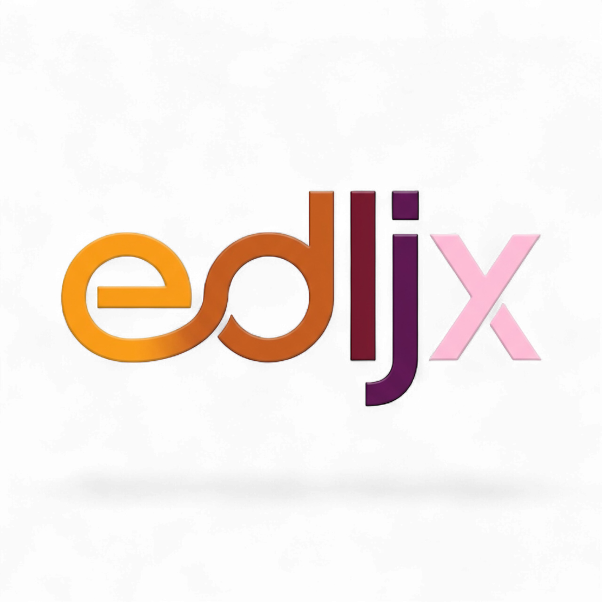

  
  <h1>Technical Writing Resources</h1>
  
<strong>Ditch the subscription, keep the productivity.</strong>

### About edljx
We are a friendly, scrappy tech hub dedicated to helping curious builders replace expensive subscriptions with practical, affordable alternatives. We believe technology should empower, not bankrupt. Whether you're a student, indie creator, or just a tinkerer, we're here to share honest guides and real-world tools that respect your wallet.

🌐 **Website:** [edljx.com](https://edljx.com)  
📧 **Community:** [members.edljx.com](https://members.edljx.com)

---

### 📖 360° Overview
**Why is this helpful?**  
This repository serves as a centralized knowledge base for this topic. Instead of scattered bookmarks, we provide a curated, maintained directory.

**Who is this for?**  
Learners and professionals seeking verified, high-quality resources.

### 🌍 Impact on the Everyday Person & Tech Enthusiast
**For the Everyday Person:**  
This isn't just "computer code"; it's about autonomy. By understanding and using these tools, you stop being a passive consumer who pays monthly rent for digital life. You become an owner. It means keeping your family photos safe without paying Apple/Google, working from anywhere without restriction, or learning a skill that can double your income.

**For the Tech Enthusiast:**  
This is your playground. These resources remove the guardrails found in commercial software. You get to see "how the sausage is made," tweak every config file, and build systems that are faster, more private, and uniquely yours. It's the difference between driving an automatic sedan and tuning a manual racecar.

**How to use this safely:**  
We verify links, but the internet changes. Always check the credibility of 3rd party resources before downloading files.

### ✨ Specific Benefits to Your Life
Saves you dozens of hours of research. We cut through the noise to find the signal.

### 📚 Additional Reading
- *No specific reading linked yet. Check the main list above.*

---

Guides, courses, and frameworks for writing documentation that humans actually want to read.

Good code with bad documentation is dead code. Learning to write clearly is the highest ROI skill for a developer. It helps you get hired, get promoted, and get your open source projects used.

Learn the 'Diataxis' framework first. It solves the 'what should I write?' problem instantly.

---

### ✍️ Frameworks & Courses
| Resource | Type | Description |
| :--- | :--- | :--- |
| **[Diataxis](https://diataxis.fr/)** | Framework | A methodology that splits docs into 4 types: Tutorials, How-To Guides, Reference, and Explanation. **Start here.** |
| **[Google Tech Writing](https://developers.google.com/tech-writing)** | Course | Google's internal coursework, made public. Excellent for learning sentence structure and clarity. |
| **[The Good Docs Project](https://thegooddocsproject.dev/)** | Templates | Open source templates for READMEs, API references, and more. |

### 🛠 Tools
| Tool | Use Case | Description |
| :--- | :--- | :--- |
| **[Write the Docs](https://www.writethedocs.org/)** | Community | A global community of documentarians. Their Slack is incredible. |
| **[Hemingway App](https://hemingwayapp.com/)** | Editing | Paste your docs here. It highlights complex sentences and passive voice. |

---
### 🤝 Contributing
Contributions are welcome! If you find a broken link or have a resource that belongs here, please open an Issue.
